# Bamazon-App

## Description of Program

This application implements a simple command line based storefront using the npm [inquirer](https://www.npmjs.com/package/inquirer) package and the MySQL database backend together with the npm [mysql](https://www.npmjs.com/package/mysql) package. The application presents two interfaces: **customer** and **manager**.

## MySQL Database Setup

In order to run this application, you should have the MySQL database already set up on your machine. If you don't, visit the [MySQL installation page](https://dev.mysql.com/doc/refman/5.6/en/installing.html) to install the version you need for your operating system. Once you have MySQL installed, you will be able to create the *bamazon* database and the *products* table with the SQL code found in [bamazon.sql](bamazon.sql). Run this code inside your MySQL client then you will be ready to proceed with running the bamazon customer and manager interfaces.

### Order of Operations In Command Line Interface (CLI)

To run the Customer interface or Manager Interface please follow the steps below in Command Line Interface (ClI):

1. Clone the repository 
    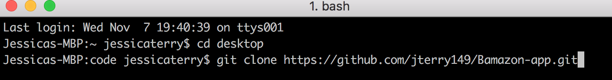

2. cd into the directory for the repository
    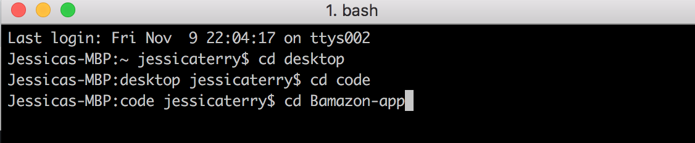

3. install npm packages and dependencies (mysql, inquirer, and npm)
    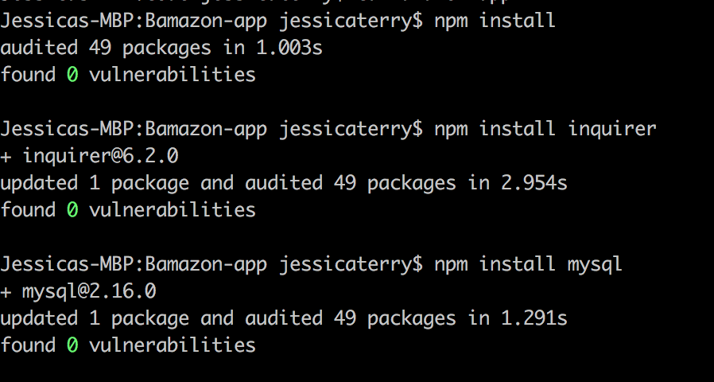

4. Run the code using node bamazonCustomer.js
    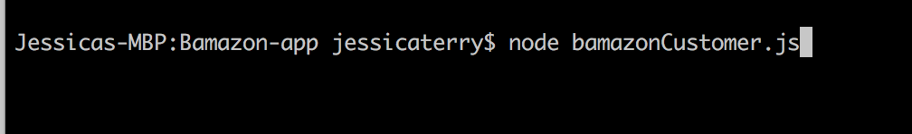

5. Run the code using node bamazonManager.js
    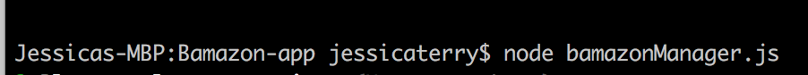

### Program Operations

Customer Interface:
    The customer interface allows the user to view the current inventory of store items: item IDs, descriptions, department in which the item is located and price. 

    Example View:
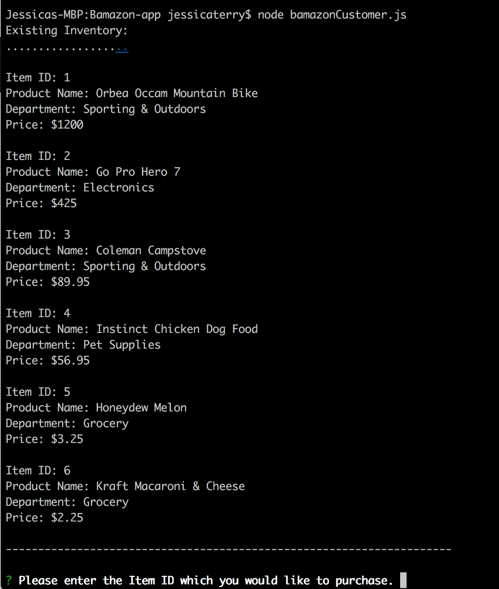  

    The user is then able to purchase one of the existing items by entering the item ID and the desired quantity. If the selected quantity is currently in stock, the user's order is fulfilled, displaying the total purchase price and updating the store database. If the desired quantity is not available, the user is prompted to modify their order.

    Example View:
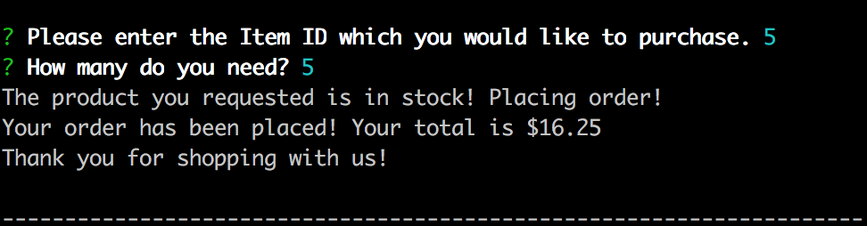

Manager Interface:
    The manager interface presents a list of five options, as below seen below. 

    Example View:
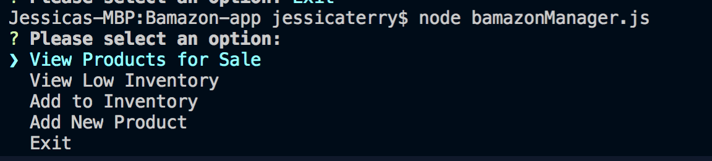
	

 
The **View Products for Sale** option allows the user to view the current inventory of store items: item IDs, descriptions, department in which the item is located, price, and the quantity available in stock. 

    Example View:
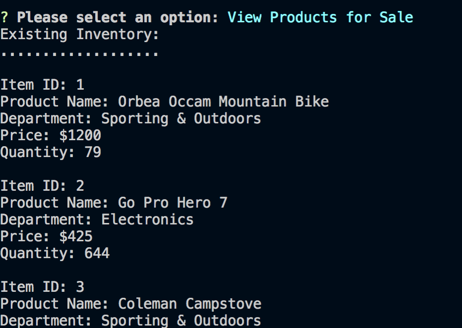

The **View Low Inventory** option shows the user the items which currently have fewer than 100 units available.

    Example View:
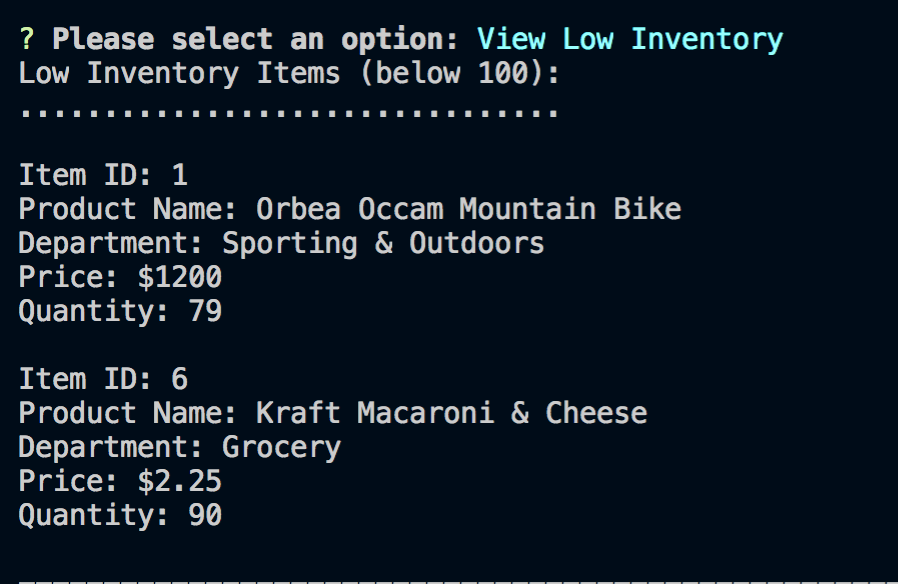    

    
The **Add to Inventory** option allows the user to select a given item ID and add additional inventory to the target item.

    Example View:
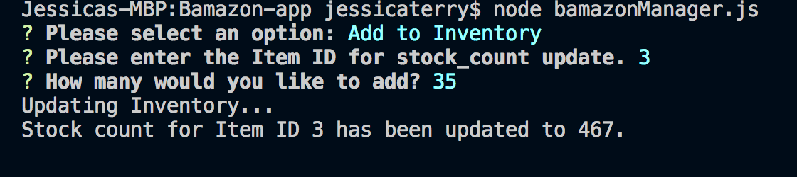

The **Add New Product** option allows the user to enter details about a new product which will be entered into the database upon completion of the form.

    Example View:
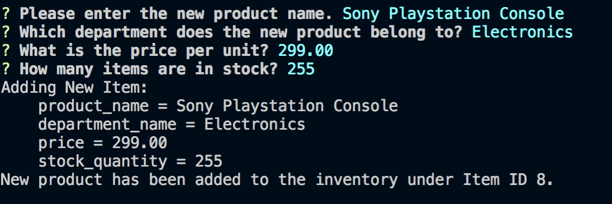

The **Exit** option allows you to exit the CLI program

    Example View:

